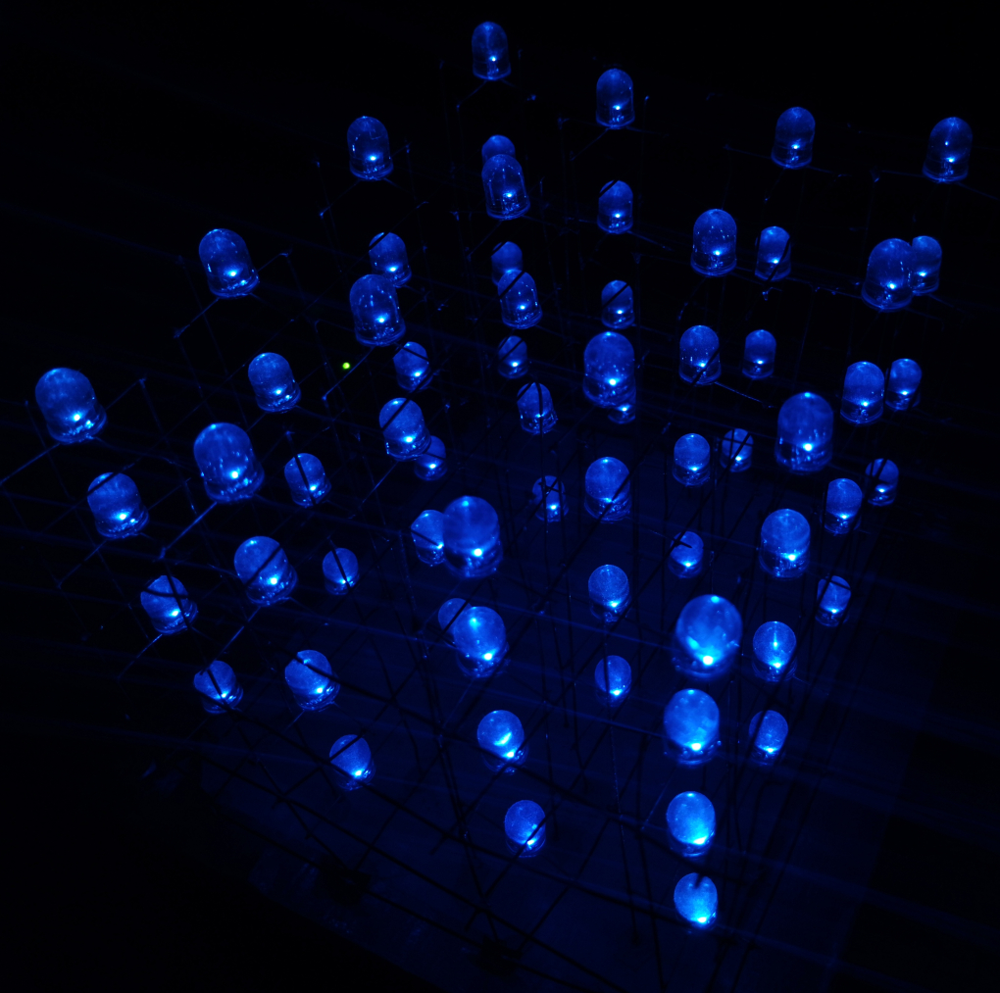

# 4x4x4 RGB LED Cube with Arduino

This project is a 4x4x4 RGB LED cube powered by an Arduino. It uses 64 RGB LEDs to create a three-dimensional display capable of displaying various colors and patterns.

## Materials

- Arduino Uno
- 64 RGB LEDs
- 4 2n2222 transistors
- 48 330ohm resistor
- 4 1Kohm resistor
- 1 10Kohm resistor
- Circuit board
- Copper wire
- Power supply (5V, 2A or higher)
- Ribbon cables

## Instructions

Having the above materials at your disposal and following the circuit diagram carefully, you will be able to implement your own RGB three-dimensional cube.

## Programming Instructions

1. Download and install the Arduino IDE.
2. Open the LED cube sketch provided in this repository.
3. Upload the sketch to the Arduino board.
4. Experiment with different colors and patterns by modifying the code as desired.

## Usage

To use the LED cube, simply power on the Arduino board and watch as the cube comes to life with colorful patterns and displays.  

## Credits

This project was inspired by various online tutorials and resources.
